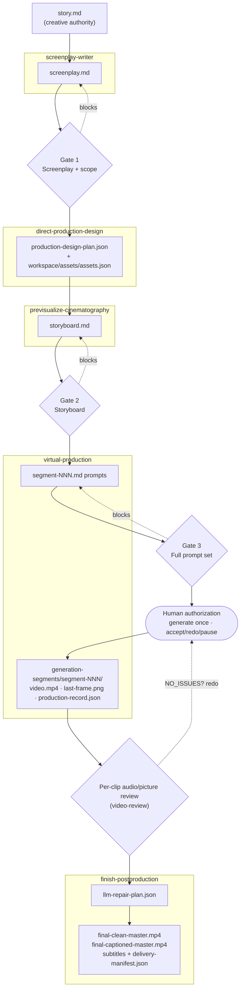

# Developer Guide

**English** · [中文](DEVELOPER.md)

This document is for developers who need to set up the environment themselves,
run scripts, or do advanced customization.

If you only want to turn a story into a finished master, **you don't need to read
this document** — see the repository root [`README.en.md`](../README.en.md): you
just write the story, name the target country, and confirm clip by clip; all the
commands, parameters, and configuration below are executed automatically by the
project.

## Requirements

- Python 3.11 or higher;
- When running media review and finishing, `ffmpeg` and `ffprobe` must be on `PATH`;
- The FFmpeg used to burn in subtitles must support the `subtitles`/libass filter
  and H.264 encoding;
- Only the image, sound, and video generation stages require remote service
  configuration;
- Uploading local reference media or persisting results to TOS requires the
  official TOS Python package.

We recommend creating an isolated environment at the repository root:

```bash
python3 -m venv .venv
source .venv/bin/activate
python3 -m pip install -e .
```

When you need TOS:

```bash
python3 -m pip install 'tos>=2.9,<3'
```

First confirm the repository structure and shared package are usable:

```bash
scripts/run_python.sh -m narrated_fable_drama.cli validate-repository
```

You can also run the underlying script directly:

```bash
scripts/run_python.sh scripts/validate_repository.py
```

Run repository Python commands through `scripts/run_python.sh`. It preserves the
selected interpreter and all command arguments, but sets the bytecode cache
destination to `.cache/pycache/` before Python starts. Pytest and Ruff use
`.cache/pytest/` and `.cache/ruff/`, respectively. The entire `.cache/` directory
is disposable, and cache directories should no longer appear throughout `src/`,
`skills/`, `scripts/`, or `tests/`. Set `PYTHON_BIN=/path/to/python` to select an
explicit interpreter.

## Creating a Task

Task directories live under `workspace/tasks/`. Put only a single UTF-8, non-empty
`story.md` at the root; do not create task forms, narration JSON, or other
creative metadata.

```text
workspace/tasks/my-fable/
└── story.md
```

## Internal Technical Pipeline Architecture

The diagram below shows the end-to-end technical data flow: which department owns
each stage, the artifact each stage produces, the three full gates and per-clip
audio/picture review, and where explicit human authorization is required. Solid
arrows are the forward pipeline; dashed arrows are gate/review feedback that blocks
downstream work until it passes.



The forward data flow is also captured textually by the authority chain in
[Creative Authority and Runtime Data](#creative-authority-and-runtime-data); this
diagram adds the gate/review/authorization control flow around it.

## Exact Behavior and Commands per Stage

### Stage 1: Story Intake

Only `story.md` is allowed at the task root as the creative authority. The story
can be full text or come from the current conversation. The project preserves the
original story's premise, character relationships, causal turns, climax,
consequences, and ending; unless the user explicitly authorizes a rewrite, it only
improves performance, pacing, clarity, and shootability.

### Stage 2: Screenplay

Codex writes it according to the screenplay contract:

```text
TASK_DIR/screenplay-writer/screenplay.md
```

The screenplay must record the target country, target language, visual style,
resolution, `16:9`, estimated duration, and the `seedance_native` audio source.
Every line contains:

```text
L-NNN; speaker=<entity>; mode=<delivery-mode>;
gate=<visible/audible trigger>;
transition=<breath/reaction/J-cut/L-cut/action/silence handoff>;
delivery=<performance>; text="<exact target-language words>"
```

Allowed delivery modes:

```text
on_camera_dialogue
on_camera_storytelling
off_camera_storytelling
external_voiceover
embedded_character_dialogue
```

The validation commands do not write the screenplay for Codex; both `build` and
`check` read and validate the current `screenplay.md`:

```bash
scripts/run_python.sh skills/screenplay-writer/scripts/build_screenplay.py build \
  --task-dir TASK_DIR
scripts/run_python.sh skills/screenplay-writer/scripts/build_screenplay.py check \
  --task-dir TASK_DIR
scripts/run_python.sh skills/screenplay-writer/scripts/character_performance_map.py \
  role-asset-scope --task-dir TASK_DIR
```

Once the screenplay is finished, it must pass the first full speech-rate gate and
the character/asset scope gate.

### Stage 3: Production Design

Production design writes first:

```text
TASK_DIR/direct-production-design/production-design-plan.json
```

Shared assets all live at the repository root:

```text
workspace/assets/assets.json
workspace/assets/characters/
workspace/assets/role-groups/
workspace/assets/locations/
workspace/assets/props/
workspace/assets/costumes/
```

Every `Kind=individual` character has its own identity image; only
`Kind=anonymous_ensemble` uses a group image. Only speaking individual characters
get a voice reference; silent characters still keep a distinct visual identity but
no voice is created. When a character doubles as the narrator, keep only one
character identity and one voice — do not create an extra "narrator character."

Before any Seedream call, first inspect semantic reuse and unregistered existing
files:

```bash
scripts/run_python.sh skills/direct-production-design/scripts/build_initial_production_design.py \
  --task-dir TASK_DIR --inspect-semantic-reuse
```

Run the build after confirming reuse, regenerating, or accepting new images. The
following parameters can be reused:

```bash
scripts/run_python.sh skills/direct-production-design/scripts/build_initial_production_design.py \
  --task-dir TASK_DIR --max-workers 4 \
  --codex-reuse-asset TARGET_ASSET_ID=SOURCE_ASSET_ID \
  --codex-regenerate-visual-asset TARGET_ASSET_ID \
  --codex-accept-generated-visual-asset ASSET_ID=SOURCE_URI
```

Finally validate:

```bash
scripts/run_python.sh skills/direct-production-design/scripts/validate_production_design.py \
  --task-dir TASK_DIR
```

When an existing media path is not in `assets.json`, the flow stops and requires
you to restore its semantics and persistent URI; never overwrite an existing file
on disk just because an "asset ID cannot be found."

### Stage 4: Storyboard

Codex orchestrates all upstream information into the single:

```text
TASK_DIR/previsualize-cinematography/storyboard.md
```

The storyboard is responsible for the final performance, cinematography, lighting,
editing, native sound, inclusion/omission of reference images and voices,
Generation Segment division, and inter-segment continuity. It must preserve, line
by line, the screenplay's exact text, speaker, delivery mode, mouth state,
listener reactions, and audio/picture handoffs.

Validate:

```bash
scripts/run_python.sh skills/previsualize-cinematography/scripts/validate_storyboard.py \
  --task-dir TASK_DIR
```

The second full gate requires every line to be speakable naturally within its
actual Segment local window, and checks few-character composition, the eyeline
axis, close-up dominance, and all position-change exceptions.

### Stage 5: Segment Prompt

Each storyboard Generation Segment is compiled into one complete natural-language
prompt that Seedance actually sees:

```text
TASK_DIR/.pending/virtual-production/seedance-segment-scripts/segment-NNN.md
```

The prompt must be self-contained with all shot order, action, performance, exact
lines, mouth state, sound, references, exclusions, entry state, and end state.
Creative meaning must not be shifted into the accompanying JSON.

You must finish all first-version prompts before running the full validation
without the `--segments` parameter:

```bash
scripts/run_python.sh skills/virtual-production/scripts/validate_segment_scripts.py validate \
  --task-dir TASK_DIR
```

Only when the output satisfies both:

```text
first_full_prompt_gate=PASS
speech_rate_gate.status=PASS
```

is per-segment video generation allowed.

### Stage 6: Per-Segment Generation and Review

Preflight the current segment before generating:

```bash
scripts/run_python.sh skills/virtual-production/scripts/preflight_segment.py \
  --task-dir TASK_DIR --segment segment-NNN
```

After getting one explicit confirmation for this segment in the current
conversation, the generation command must provide both the target segment and the
ephemeral human-confirmation assertion:

```bash
scripts/run_python.sh skills/virtual-production/scripts/generate_segment_videos.py \
  --task-dir TASK_DIR \
  --segments segment-NNN \
  --human-confirmed-segment segment-NNN
```

If the current segment depends on the previous one, you may pass
`--observed-predecessor SEGMENT_ID=PROVIDER_ATTEMPT_ID` as required by preflight
only after the previous segment's exact provider attempt has completed
audio/picture review, returned `NO_ISSUES`, and handled any necessary continuity
fixes.

Successful current media lives at:

```text
TASK_DIR/.pending/virtual-production/generation-segments/segment-NNN/
├── video.mp4
├── last-frame.png
└── production-record.json
```

After each generation you must watch the full video at normal speed with sound,
and check it item by item against the audio/picture review checklist listed under
the README "Core Features · End-to-End Automatic QC & Correction." Even if review
returns `NO_ISSUES`, you must wait for the user to decide accept, redo with
changes, retry as-is, or pause; a failure does not trigger an automatic retry.

### Stage 7: Finishing and Delivery

Once every current Segment has an accepted `video.mp4` and a matching
`production-record.json`, and the user has confirmed the assembly plan, first
generate real media evidence:

```bash
scripts/run_python.sh skills/finish-postproduction/scripts/inspect_finish_media.py \
  --task-dir TASK_DIR
```

Codex must review the picture and sound evidence for 3 seconds on each side of
adjacent segment boundaries, then write:

```text
TASK_DIR/.pending/finish-postproduction/llm-repair-plan.json
```

Validate the repair plan:

```bash
scripts/run_python.sh skills/finish-postproduction/scripts/validate_repair_plan.py \
  --task-dir TASK_DIR \
  --evidence-manifest \
    TASK_DIR/.pending/finish-postproduction/llm-evidence/evidence-manifest.json \
  --repair-plan TASK_DIR/.pending/finish-postproduction/llm-repair-plan.json
```

When there are uncertain cut points, dissolves, colors, or sound handoffs, first
render short candidate clips and inspect them manually; do not let the script
decide creative repairs automatically. Finally execute:

```bash
scripts/run_python.sh skills/finish-postproduction/scripts/finish_postproduction.py \
  --task-dir TASK_DIR \
  --evidence-manifest \
    TASK_DIR/.pending/finish-postproduction/llm-evidence/evidence-manifest.json \
  --repair-plan TASK_DIR/.pending/finish-postproduction/llm-repair-plan.json
```

Subtitle text comes directly from the Storyboard Ordered Shots; ASR is not the
text authority. The clean and captioned masters must have equal duration and
preserve synchronized native audio.

## The Six Production Departments

Each department only modifies the artifacts it owns:

| Department | Input | Owned outputs and responsibilities |
| --- | --- | --- |
| `screenplay-writer` | `story.md`, country/style/resolution from the conversation | The single `screenplay.md`; story adaptation, exact lines, delivery mode, performance, state changes, narration switches |
| `direct-production-design` | Story, validated screenplay, shared asset library | `production-design-plan.json`; characters, voices, wardrobe, props, locations, and the shared asset catalog |
| `previsualize-cinematography` | Screenplay, production design, asset catalog | The single `storyboard.md`; performance, cinematography, lighting, editing, Segment division, reference binding, and continuity |
| `virtual-production` | Validated storyboard | One complete `segment-NNN.md` prompt per segment; preflight, Seedance submission, and current generated media |
| `video-review` | Authoritative documents or complete audio/picture clips | Independent review results; returns `NO_ISSUES` or minimal fixes routed to the responsible department |
| `finish-postproduction` | All accepted Segments and real media evidence | Repair decisions, assembly, subtitles, clean/captioned masters, and the delivery manifest |

The full rules live respectively in:

```text
skills/screenplay-writer/SKILL.md
skills/direct-production-design/SKILL.md
skills/previsualize-cinematography/SKILL.md
skills/virtual-production/SKILL.md
skills/video-review/SKILL.md
skills/finish-postproduction/SKILL.md
```

## The Three Full Gates

1. **Screenplay gate:** checks the full screenplay, character scope, and each
   line's owning Shot duration.
2. **Storyboard gate:** checks the full storyboard, local speaking windows,
   reference binding, few characters, the eyeline axis, close-up dominance, and
   position-change exceptions.
3. **Prompt gate:** after all first-version prompts are finished, checks the
   complete set at once — per-shot framing, references, exact lines, exclusions,
   and local speaking windows.

Unified speech-rate hard limits:

- CJK text: no more than 4.0 characters per second;
- Non-CJK text: no more than 2.6 words per second;
- Each line also needs a 0.25-second start/end margin.

Any gate failure blocks downstream work and must not be skipped as a warning.

## Creative Authority and Runtime Data

Creative facts exist only in:

```text
story.md
-> screenplay-writer/screenplay.md
-> previsualize-cinematography/storyboard.md
-> .pending/virtual-production/seedance-segment-scripts/segment-NNN.md
```

The allowed JSON only records:

- Asset planning and shared asset lookup;
- The current attempt facts of provider requests;
- Generated media records;
- Technical QC and repair execution parameters;
- The final delivery manifest.

Do not create a second screenplay, storyboard JSON, narration plan, voice plan,
translation tracker, prompt manifest, human-confirmation receipt, or private
creative ledger. User accept/redo decisions stay in the current conversation and
are not written as approval JSON.

## Directory Structure

```text
create-narrated-fable-drama/
├── AGENTS.md                         # Efficient locating and search rules
├── README.md                         # User-facing usage guide
├── docs/DEVELOPER.md                 # Developer/advanced technical guide (this document)
├── SKILL.md                          # Overall orchestration, global constraints, completion conditions
├── agents/                           # Interface metadata for the root Skill
├── references/                       # Project-wide production and human-collaboration standards
├── scripts/
│   └── validate_repository.py        # Repository structure and shared package compile checks
├── src/narrated_fable_drama/
│   ├── cli.py                        # Project-level CLI
│   ├── core/                         # Paths, context, JSON, speech rate, and common validation
│   ├── contracts/                    # Screenplay, asset, Storyboard, and Segment contracts
│   ├── media/                        # Unified FFmpeg/FFprobe boundary
│   └── providers/                    # Seedream, Seedance, SeedAudio remote boundary
├── skills/
│   ├── screenplay-writer/
│   ├── direct-production-design/
│   ├── previsualize-cinematography/
│   ├── virtual-production/
│   ├── video-review/
│   └── finish-postproduction/
├── tests/unit/                       # Unit tests
└── workspace/
    ├── assets/                       # Cross-task shared, single asset library
    └── tasks/                        # Individual production tasks
```

A complete task may finally contain:

```text
TASK_DIR/
├── story.md
├── screenplay-writer/
│   └── screenplay.md
├── direct-production-design/
│   └── production-design-plan.json
├── previsualize-cinematography/
│   └── storyboard.md
├── .pending/
│   ├── virtual-production/
│   │   ├── seedance-segment-scripts/
│   │   └── generation-segments/
│   └── finish-postproduction/
│       ├── llm-evidence/
│       └── llm-repair-plan.json
└── finish-postproduction/
    ├── final-clean-master.mp4
    ├── final-captioned-master.mp4
    ├── final-delivery-manifest.json
    └── subtitles/
        ├── subtitle-cues.json
        ├── master.srt
        └── master.vtt
```

## Provider Configuration

Providers read configuration only from the host process environment; they do not
auto-load a repository `.env`. Do not commit secrets to the repository.

| Capability | Required environment variables |
| --- | --- |
| Seedream images | `ARK_BASE_URL`, `SEEDREAM_API_KEY`, `SEEDREAM_MODEL` |
| Seedance video creation | `ARK_BASE_URL`, `SEEDANCE_API_KEY`, `SEEDANCE_MODEL` |
| Seedance query/cancel | `ARK_BASE_URL`, `SEEDANCE_API_KEY` |
| SeedAudio voice | `SEEDAUDIO_API`, `SEEDAUDIO_API_KEY`, `SEEDAUDIO_MODEL` |
| TOS persistence | `STORAGE_TOS_REGION`, `STORAGE_TOS_ENDPOINT`, `STORAGE_TOS_BUCKET`, `STORAGE_TOS_ACCESS_KEY_ID`, `STORAGE_TOS_SECRET_ACCESS_KEY`, `STORAGE_TOS_KEY_PREFIX` |

`ARK_BASE_URL` and `SEEDAUDIO_API` must be HTTPS. The current Seedream adapter
only accepts the fixed model ID declared in code; using any other value fails
immediately.

Safely inspect configuration status without printing secrets:

```bash
scripts/run_python.sh -m narrated_fable_drama.providers.seedream --pretty config
scripts/run_python.sh -m narrated_fable_drama.providers.seedance --pretty config
scripts/run_python.sh -m narrated_fable_drama.providers.seedaudio --pretty config
```

Remote access is only allowed through `src/narrated_fable_drama/providers/`.
Department scripts must not re-implement credentials, HTTP, uploads, polling, or
result persistence.

To place the repository or workspace elsewhere, use:

```text
NARRATED_FABLE_DRAMA_ROOT
NARRATED_FABLE_DRAMA_WORKSPACE
```

A custom root must contain `pyproject.toml` and `SKILL.md`.

## Common Blockers

| Symptom | Cause and handling |
| --- | --- |
| Stops before writing the screenplay | The required target country is missing; provide it in the conversation |
| `Cannot find the narrated-fable repository` | Run from inside the repository, or set a valid `NARRATED_FABLE_DRAMA_ROOT` |
| Cannot import `narrated_fable_drama` | Run `python3 -m pip install -e .` at the repository root |
| `speech_rate_gate` fails | Shorten the exact line or add more speaking time to the owning Shot/Segment |
| Character/asset scope fails | Check the screenplay `Kind`, character definitions, and the limit of at most 8 visual types |
| An unregistered asset file is found | Restore its directory semantics and provider URI into `workspace/assets/assets.json`; do not overwrite generation |
| `first_full_prompt_gate` is not `PASS` | Re-validate the complete first-version prompt set without `--segments` |
| A provider reports a missing environment variable | Run the corresponding `--pretty config` and complete the configuration in the host environment |
| Generation or review fails | No auto-retry; report the issue and obtain one fresh authorization for the current Segment |
| Finishing reports missing current media | Confirm every Storyboard Segment has a matching `video.mp4` and `production-record.json` |
| `ffmpeg`/`ffprobe` not found | Install FFmpeg and confirm the binaries are on `PATH` |
| Subtitle burn-in fails | Use FFmpeg with the libass `subtitles` filter and an H.264 encoder |

## Development and Validation

Run the test closest to your change first, then the full unit tests and structure
check:

```bash
scripts/run_python.sh -m pytest tests/unit/test_relevant_file.py -q
scripts/run_python.sh -m pytest tests/unit -q
scripts/run_python.sh scripts/validate_repository.py
```

The code style configuration lives in `pyproject.toml`:

```bash
scripts/run_python.sh -m ruff check src skills scripts tests
```

For repository locating and searching, follow `AGENTS.md`: first narrow the scope
using the path map, then search for symbols and read only the content near the
hits; do not recursively scan the very large `workspace/` by default.

## Further Reading

- `SKILL.md`: the complete overall orchestration, authority chain, and human gates;
- `references/narrated-fable-drama-production-standard.md`: the project-wide
  production standard;
- `references/human-in-the-loop-guided-workflow.md`: conversational directorial
  control and per-segment authorization;
- `src/narrated_fable_drama/providers/README.md`: the unified remote provider
  boundary;
- Each `skills/<department>/SKILL.md`: department-level inputs, outputs,
  responsibilities, and hard rules.
